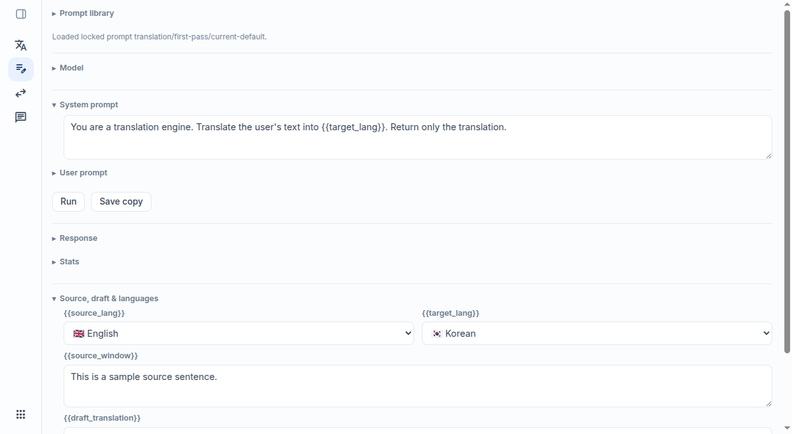
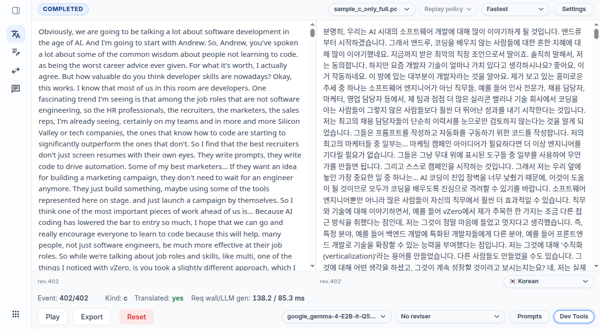
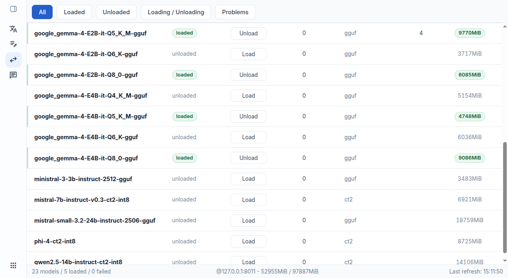
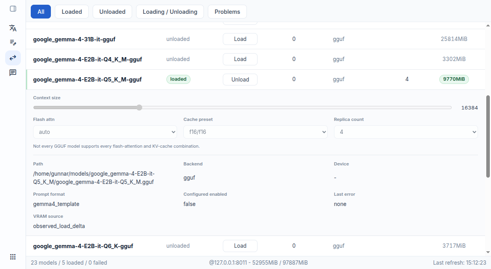
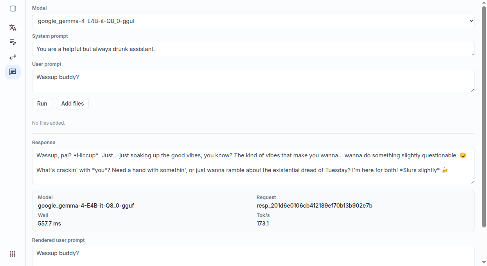
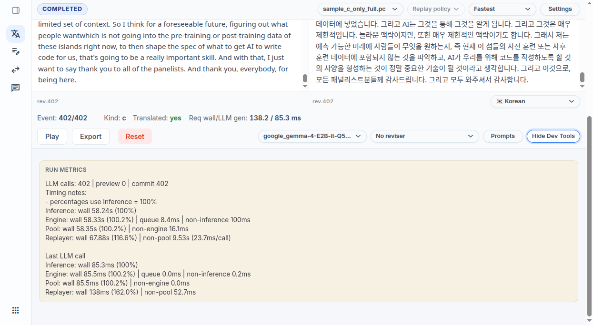

# LLM Workbench

LLM Workbench is a small personal workbench/playground for trying out LLM-driven workflows.

Some parts are meant to stay as permanent tools, especially:
- `LLM Pool / Models`
- `Prompt Testing / Ad hoc prompt`

Other parts are more exploratory. `Realtime Translation / Replay & Translate` started here, and parts of that workflow are already being extracted or reused elsewhere.

## Index

- [What It Does](#what-it-does)
- [Repository Role](#repository-role)
- [Related Repositories](#related-repositories)
- [Code Map](#code-map)
- [API Surface](#api-surface)
- [Runtime Model](#runtime-model)
- [Configuration](#configuration)
- [Local Development](#local-development)
- [Tests](#tests)
- [Screenshots](#screenshots)
- [License](#license)

## What It Does

- `LLM Pool / Models`
  List, load, unload, and inspect models through the `llm-pool` admin API.
- `Prompt Testing / Ad hoc prompt`
  Run one-off prompts against available models without building a dedicated workflow first.
- `LLM Pool / Chat`
  Hold a multi-turn conversation with a loaded model. Models that report multi-turn support use real message history; others fall back to a flattened single-prompt transcript (shown with a warning). A single "Add files" button accepts images (on vision models) and text files.
- `Realtime Translation / Replay & Translate`
  Replay `.pc` transcript event streams, inspect first-pass and second-pass translation behavior, and export session state.
- `Realtime Translation / Prompt Library`
  Manage prompt sets used by the translation workflow.

## Repository Role

- This repo provides the FastAPI API, replay session orchestration, prompt-library storage, and `llm-pool` proxy routes.
- The browser UI lives in `static/` and is served by the FastAPI app on the same origin.
- The backend does not run model inference itself; model calls go through `llm-pool`.
- Replay translation runtime behavior is delegated to the extracted realtime translation engine.

## Related Repositories

- [realtime-translation-engine](https://github.com/Bobcat/realtime-translation-engine)
  Extracted translation runtime used by the replay workflow.
- [llm-pool](https://github.com/Bobcat/llm-pool)
  Provides the model and admin APIs used by the workbench.
- [omniscripta](https://github.com/Bobcat/omniscripta)
  Can produce `.pc` replay files from realtime transcript streams.

## Code Map

- `app/main.py` creates the FastAPI app, mounts API routes, exposes the replay websocket, and serves the frontend from `static/`.
- `app/router.py` wires the `/api` router groups.
- `app/llm_pool/` proxies model listing and model admin actions to `llm-pool`.
- `app/prompt_testing/` implements the ad hoc prompt runner.
- `app/realtime_translation/replay/` manages replay sessions, translation dispatch, runtime export, websocket transport, and metrics.
- `app/realtime_translation/prompt_library/` manages translation prompt sets.
- `promptlib/` contains prompt-library storage helpers.
- `static/` contains the browser UI. It has no build step; the browser loads source files directly as ES modules.
- `static/app.js` registers UI workflows and shell routing.
- `static/src/api-client.js` contains the same-origin backend API client and replay websocket wrapper.
- `static/src/workflows/` contains the replay, prompt-library, LLM-pool, TTS-pool, ad hoc prompt runner, and chat screens.
- `config/settings.json` contains committed defaults.
- `data/realtime_translation/sample/` contains sample `.pc` replay files.
- `deploy/systemd/` contains example service wiring for local deployments.

## API Surface

- `/api/models*` exposes model listing and model admin proxy routes.
- `/api/prompts/run` runs ad hoc prompts.
- `/api/chat/run` runs a multi-turn chat turn (or a flattened single-prompt fallback) against a model.
- `/api/prompts*` manages the realtime translation prompt library.
- `/api/replay*` creates and controls replay sessions.
- `/ws/replay/{session_id}` streams replay updates to the UI.

## Runtime Model

LLM Workbench keeps workflow state in the backend process while a session is active. The browser creates replay sessions, updates model/prompt/language settings over HTTP, and receives replay events over a websocket.

Model inference and model administration are external concerns owned by `llm-pool`. Translation replay orchestration lives in this backend, while reusable translation state and dispatch behavior is implemented in `realtime-translation-engine`.

The browser UI is a same-origin static app under `static/`. The backend owns replay sessions, prompt-library persistence, model/pool proxying, and websocket event delivery.

## Configuration

- `config/settings.json` contains committed defaults.
- `config/local.json` is ignored and can be used for local overrides.
- `deploy/systemd/llm-pool-tunnel.example.service` shows one way to tunnel a remote `llm-pool` API to `127.0.0.1:8011`.

## Local Development

Install the backend and the extracted translation engine in editable mode:

```bash
python3 -m venv .venv
./.venv/bin/python -m pip install -e .
./.venv/bin/python -m pip install -e ../realtime-translation-engine
```

Run the backend from this repo; it serves the browser UI from `static/`.

```bash
./.venv/bin/python -m uvicorn app.main:app --host 127.0.0.1 --port 8000
```

Open:

```text
http://127.0.0.1:8000/
```

## Tests

```bash
./.venv/bin/python -m unittest discover -s tests
node --input-type=module --check < static/src/workflows/llm-pool/index.js
node --input-type=module --check < static/src/workflows/prompt-runner/index.js
node --input-type=module --check < static/src/workflows/chat/index.js
```

## Screenshots

### Prompt Library



### Replay & Translate



### Model Pool



### Model Settings



### Ad Hoc Prompt Testing



### Replay Metrics



## License

Licensed under the Apache License, Version 2.0. See [LICENSE](LICENSE).
